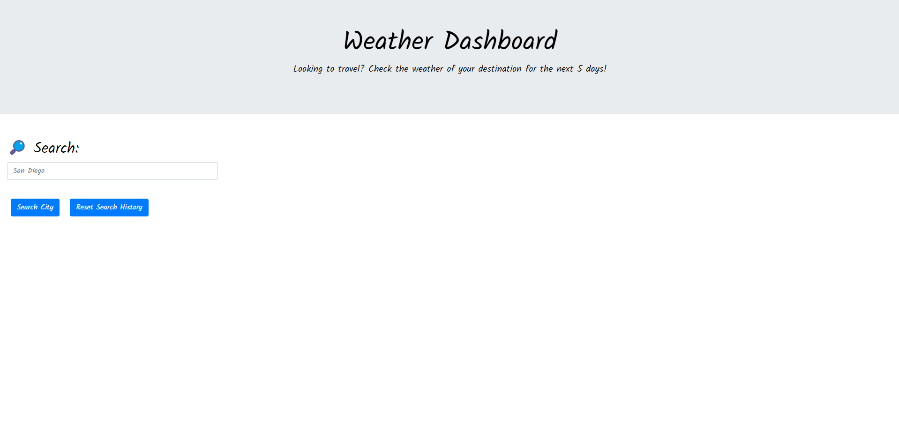
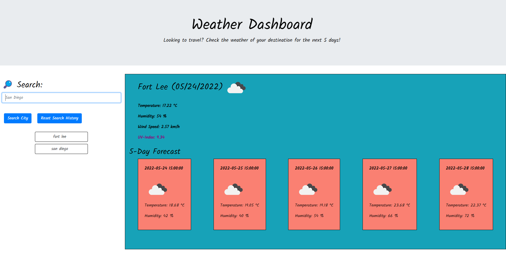
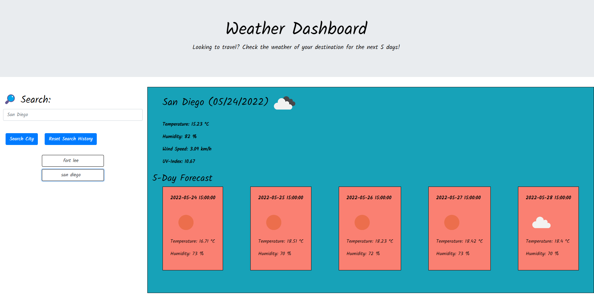

# Weather Dashboard

## Description

The purpose in creating this weather dashboard was to familiarize myself of fetching responses and data from existing third party APIs. It was also created to give users the weather data of any city on the globe and the forecast of the next five days.

The site was designed to be movile friendly and is equipped with a search history section where users can click on the button to go check the weather stored within the button.

There are still many kinks I would like to fix up in this application. For one, if the user inputs a non valid city, the search history button of the incorrect city will still pop up. Future work on the project will be to style and add the feature to filter out non existing city names.

If you would like to check the weather, please [click here](https://lunirs.github.io/weather-dashboard/) to be lead to my deployed link!

## Installation

With building this dashboard, I first started off with some pseudo code which you can find below. Not all was mapped out in the pseudo code. However, as I worked through with the base that I had, I was able to figure out for the most part, what I had to do and use to obtain my final results.

We would need some functions here like:

```
1. function to initialize my data
2. function to save to and get from local history
3. function that would fetch response from 3rd party api to obtain city's weather information
4. function that would fetch response from 3rd party api to obtain uv index value based on city's longitute and latitude coordinates.
5. function to render my search history as buttons on the page
6. function to render 5 day forecast onto the page
```

To go about this, I first used the api from openweathermap and received an api key. I then wrote the functions that needed data from the api and fetched the necessary response and data via query parameters.

Once everything was fetched and the response was good, I then rendered the weather values onto the html page.

I then added the functions that set and get data into and from local storage and rendered them as buttons on the page.

Overall, the user should have a smooth experience in searching weather of their choosing.

```
Dependencies
need search bar form element
need submit button element
need 5 day forecast container element so i can append new results to it
need user input element
need button elements for newly created button elements for history
need element for clear history button

Data States
need latitude and longitude
api link https://api.openweathermap.org/data/2.5/weather?lat=%7Blat%7D&lon=%7Blon%7D&appid=%7BAPI key}
link for cities "https://api.openweathermap.org/data/2.5/weather?q=" + city + "&appid=" + apiKey
need api key a615206688fa7fa4d02f98f637bd877b

Functions

need functions to get all the necessary data from the api
function to get user input's city weather
above should get me all of the necessary information from the api
temp
humidity
uv index
wind speed

User Interactions
submit button user interaction
newly created button from search history button interactions
```

## Usage

Here are some screenshots of my page!

## Start Page



## First City Search


## Second City Search



## Search History Button pressed



## Credits

The following list below were resources I used to finish this application

1. [OpenWeatherMap Api](https://openweathermap.org/api)
2. [Momentjs](https://momentjs.com/docs/#/displaying/)
3. [Bootstrap](https://getbootstrap.com/)
4. [jQuery](https://jquery.com/)
5. [jQuery cheatsheet](https://oscarotero.com/jquery/)

## License

Copyright (c) [2022] [Daniel Hong]
